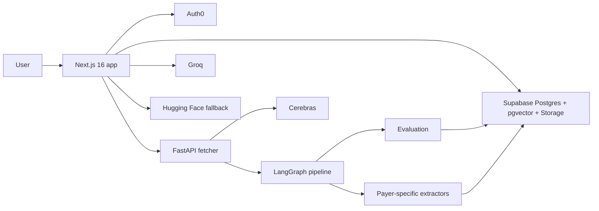

# PolicySync

PolicySync is an AI-assisted healthcare policy intelligence platform for medical benefit drug policies. It ingests payer artifacts, detects changes, extracts structured coverage rules, routes extractions through human review, and exposes the approved data through semantic search, natural-language Q&A, comparison views, and a changelog.

Built by `Team Ruby`:

- Shreya Prakash
- Uma Maheswar Reddy N

This repository contains the full application stack:

- A `Next.js 16` frontend and API layer
- A `FastAPI` fetcher and extraction service
- A `Supabase/Postgres + pgvector` persistence layer
- A `LangGraph` pipeline for chunking, extraction, evaluation, and draft persistence

## Table of Contents

- [Executive Summary](#executive-summary)
- [Why It Matters](#why-it-matters)
- [Demo Walkthrough](#demo-walkthrough)
- [What the System Does](#what-the-system-does)
- [Architecture](#architecture)
- [Core Workflows](#core-workflows)
- [Repository Layout](#repository-layout)
- [Technology Stack](#technology-stack)
- [Data Model](#data-model)
- [Authentication and Authorization](#authentication-and-authorization)
- [API Surface](#api-surface)
- [Local Development](#local-development)
- [Environment Variables](#environment-variables)
- [Database and Seeding](#database-and-seeding)
- [Operational Notes](#operational-notes)
- [Known Constraints](#known-constraints)

## Executive Summary

Healthcare policy review is still largely manual. Teams have to monitor payer PDFs and portals, read long policy documents, detect changes, extract relevant criteria, and compare coverage positions across payers. That process is slow, difficult to scale, and risky when policy changes affect access, compliance, or contracting decisions.

PolicySync turns that workflow into a governed AI pipeline:

- ingest payer artifacts
- detect changes automatically
- extract structured policy rules
- route extractions through human review
- publish approved rules into a searchable knowledge layer
- expose the result through search, Q&A, comparison, and changelog views

This makes the product useful both as a hackathon demo and as a real internal tool architecture.

## Why It Matters

Medical benefit drug policies directly influence operational and financial outcomes. A change in preferred status, step therapy requirements, or prior authorization criteria can affect:

- patient access
- reimbursement workflows
- internal policy operations
- contracting and rebate strategy

The value of PolicySync is not just that it can "chat with documents." It creates a structured and auditable workflow for converting messy payer policy content into governed operational intelligence.

## Demo Walkthrough

For a live demo, the cleanest story is:

1. Sign in (search, Q&A, and changelog require Auth0).
2. Show the **Monitoring** dashboard (`/admin`) and explain that payer sources are monitored continuously.
3. Trigger **Fetch Now** for a payer and explain that the system only processes artifacts when the content hash changes.
4. Show the **Review queue** to demonstrate human-in-the-loop governance.
5. Approve a draft extraction and explain that it becomes queryable only after review.
6. Open **ISearch** (`/search`): use **Q&A**, **Compare**, and **Recent updates** tabs; ask a concrete policy question.
7. Show cross-payer comparison for a drug.
8. End with **Policy changes** (full history at `/changelog`) or the **Recent updates** tab to show tracked changes over time.

If you need a fast narrative in under three minutes, use:

- Problem: policy review is manual and fragile
- Solution: AI-assisted ingestion, extraction, and review
- Proof: searchable rules, Q&A, comparison, and change tracking
- Trust: human approval and audit trail

## What the System Does

PolicySync is built for teams that monitor payer policy documents and need a structured, queryable view of coverage rules.

At a high level, the system:

1. Fetches policy artifacts from configured sources.
2. Detects whether the content has changed using a SHA-256 hash.
3. Extracts text from PDF, HTML, and DOCX artifacts.
4. Splits content into retrieval-friendly chunks and generates contextual summaries.
5. Routes documents to payer-specific extraction logic.
6. Evaluates extraction quality before surfacing drafts for review.
7. Lets an admin approve, reject, or delete drafts.
8. Publishes approved rules with embeddings for search and Q&A.
9. Tracks rule changes over time and exposes them in a changelog view.

Primary end-user features:

- Semantic policy search
- Natural-language Q&A with citations
- Cross-payer drug comparison
- Policy change tracking
- Admin monitoring and manual fetch triggers
- Human-in-the-loop governance with audit logging

## Architecture



### Runtime responsibilities

#### Next.js app

- Hosts the UI for landing, search, changelog, admin, and review pages
- Enforces route protection through Auth0 session middleware (most product routes require login; see [Authentication and Authorization](#authentication-and-authorization))
- Top navigation labels: **Monitoring** | **Review queue** | **ISearch** | **Policy changes** (role-dependent). The `/search` page uses tabs: **Q&A**, **Compare**, **Recent updates** (see [`components/viewer/search-page-tabs.tsx`](components/viewer/search-page-tabs.tsx))
- Exposes server-side API routes for search, Q&A, publishing, audit reads, config, and fetch orchestration
- Uses the Supabase service role client for trusted database operations

#### FastAPI fetcher

- Fetches raw payer artifacts
- Extracts text and table content from supported formats
- Computes content hashes for change detection
- Uploads artifacts to Supabase Storage
- Serves embeddings for the app layer
- Runs the LangGraph extraction pipeline

#### Supabase

- Stores source configuration, artifact versions, chunks, draft extractions, published rules, audit events, and cache data
- Provides pgvector similarity search
- Stores uploaded source artifacts

#### LLM and retrieval layer

- Groq powers HyDE generation and answer synthesis (Q&A)
- Cerebras is used for contextual chunk summaries when available
- Google Gemini is used for parts of extraction and changelog classification when `GOOGLE_AI_API_KEY` is set
- Hugging Face is used as an embedding fallback if the local fetcher embedding endpoint is unavailable

## Core Workflows

### 1. Fetch and ingestion

The admin dashboard or a cron-triggered route calls `GET/POST /api/fetch-check`.

For each active source:

1. Next.js calls the fetcher service.
2. The fetcher downloads the upstream artifact.
3. The artifact is hashed.
4. If the hash is unchanged, the workflow exits early.
5. If the hash changed, a new `artifact_versions` row is created.
6. The LangGraph pipeline is triggered for that source/version pair.

### 2. Extraction pipeline

The fetcher pipeline is implemented in [`fetcher/pipeline/graph.py`](fetcher/pipeline/graph.py).

Nominal flow:

1. `chunker`
2. `embedder`
3. payer-specific extractor
4. `evaluator`
5. `persist_draft` or `reject_draft`

Notable behavior:

- Priority Health can bypass LLM-heavy extraction because its source format is table-oriented.
- Contextual summaries are generated per leaf chunk to improve retrieval quality.
- Failed evaluation results are stored as `eval_failed` drafts instead of disappearing.

### 3. Human review and publishing

The review queue pulls from `draft_extractions`.

An admin can:

- approve a draft
- reject a draft
- delete a draft

Approval does the following:

1. Optionally accepts reviewer-overridden JSON.
2. Creates embeddings for the published rule payload.
3. Looks up a previous published rule for the same source/drug.
4. Computes a `change_summary`.
5. Inserts records into `published_rules`.
6. Marks the draft as approved.
7. Emits audit events.

### 4. Search

Search is handled by [`app/api/search/route.ts`](app/api/search/route.ts).

Supported modes:

- `default`: semantic search over `published_rules`
- `compare`: cross-payer drug comparison
- `versions`: version history for a payer/drug pair

Default search flow:

1. Generate a HyDE document from the query.
2. Embed the generated text.
3. Call the `search_published_rules` Supabase RPC.
4. Return ranked rules.
5. Fall back to keyword filtering if embedding/search fails.

### 5. Q&A

Q&A is handled by [`app/api/qa/route.ts`](app/api/qa/route.ts).

Flow:

1. Normalize and cache the question.
2. Extract payer and drug hints from the prompt.
3. Retrieve matching rules from Supabase.
4. Synthesize an answer via Groq.
5. Return prose plus citations and confidence metadata.

### 6. Change tracking

Published rules can store a `change_summary` JSON object that captures:

- clinical changes
- cosmetic changes
- a pointer to the previous rule version
- detection metadata

The changelog UI is backed by this data and the `recent_changes` database view.

## Repository Layout

```text
app/                    Next.js App Router pages and API routes
components/             UI components for admin, review, search, QA, changelog
components/viewer/      Search page tabs shell (Q&A, Compare, Recent updates)
fetcher/                FastAPI service and LangGraph pipeline
lib/                    Shared server utilities (Auth0, Supabase, embeddings, audit)
scripts/                Seed, demo, migration, and maintenance scripts
seed/                   Sample payer artifacts for demo/seed flows
supabase/migrations/    Schema and RPC definitions
types/                  Shared TypeScript domain types
public/                 Static assets
```

Important paths:

- [`app/api/search/route.ts`](app/api/search/route.ts)
- [`app/api/qa/route.ts`](app/api/qa/route.ts)
- [`app/api/fetch-check/route.ts`](app/api/fetch-check/route.ts)
- [`app/api/publish/route.ts`](app/api/publish/route.ts)
- [`middleware.ts`](middleware.ts)
- [`components/viewer/search-page-tabs.tsx`](components/viewer/search-page-tabs.tsx)
- [`lib/auth0.ts`](lib/auth0.ts)
- [`fetcher/main.py`](fetcher/main.py)
- [`fetcher/pipeline/graph.py`](fetcher/pipeline/graph.py)
- [`supabase/migrations/001_init.sql`](supabase/migrations/001_init.sql)
- [`supabase/migrations/003_payer_schema.sql`](supabase/migrations/003_payer_schema.sql)

## Technology Stack

### Frontend and API

- Next.js `16.2.2`
- React `19.2.4`
- TypeScript
- Tailwind CSS 4
- shadcn/ui-style components

### Backend services

- FastAPI
- LangGraph
- Supabase Python client

### Data and infrastructure

- Supabase Postgres
- pgvector
- Supabase Storage
- Vercel-compatible Next.js deployment

### Models and AI services

- Groq for HyDE generation and answer synthesis
- Cerebras for contextual chunk summarization
- Google Gemini (optional) for extraction / changelog flows when configured
- sentence-transformers `all-mpnet-base-v2` embeddings via the fetcher
- Hugging Face Inference API fallback for embeddings

## Data Model

The canonical extracted entity is `ExtractedRule`, defined in [`types/index.ts`](types/index.ts).

It captures:

- drug identity
- payer and policy identity
- coverage/access position
- prior authorization and step therapy criteria
- alternatives and restrictions
- citations and source traceability
- change metadata

### Primary tables

#### `sources`

Configured payer endpoints and fetch metadata.

#### `artifact_versions`

One row per changed artifact fetch. Stores the content hash and storage path.

#### `artifact_chunks`

Small-to-big retrieval chunks with embeddings and contextual summaries.

#### `draft_extractions`

AI-generated extraction results waiting for review or marked as failed.

#### `published_rules`

Approved, queryable rules used by search, Q&A, and comparison views.

#### `audit_events`

Append-only operational and governance log.

#### `qa_cache`

Question/answer cache with a 24-hour effective TTL in the app logic.

## Authentication and Authorization

Auth is implemented with `@auth0/nextjs-auth0`.

Roles are read from the custom JWT claim namespace **`https://policysync.app/roles`** (see `AUTH0_ROLES_CLAIM` in [`lib/auth0.ts`](lib/auth0.ts)). Configure your Auth0 Action / Rule so the ID token includes this claim (typically mirroring `app_metadata.roles`). The namespace URL does not need to resolve; it is only a claim key.

**Public** (no session) — enforced in [`middleware.ts`](middleware.ts):

- `/` — landing
- `/api/auth/*` — Auth0 login, callback, logout
- `/api/health` — health check for demos and monitoring

**Cron** — `GET /api/fetch-check` accepts `x-cron-secret` matching `CRON_SECRET` and runs without a user session.

**Authenticated** — all other pages and API routes (including `/search`, `/changelog`, `/api/search`, `/api/qa`, `/api/changelog`) require a valid Auth0 session. Unauthenticated browser visits redirect to login; unauthenticated API calls return `401`.

**Admin-only** routes include `/admin`, `/review`, `/api/sources`, `POST` (and non-cron `GET`) `/api/fetch-check`, `/api/publish`, `/api/audit`, and related admin APIs. See `PROTECTED_ROUTES` in middleware.

Notes:

- **`viewer`** — signed-in read-only access to search, changelog, and analyst APIs.
- **`admin`** — monitoring dashboard, review queue, fetch orchestration, publish.
- A **`reviewer`** role exists in shared types; **`/review` is restricted to `admin`** in the current middleware.

## API Surface

Most JSON APIs below require **Auth0** (see middleware). They return **503** with a clear JSON body if Supabase is not configured (`isSupabaseConfigured()`).

Representative routes:

- `GET /api/search`
  - semantic search
  - compare mode
  - version history mode
- `POST /api/qa`
  - natural-language question answering over approved rules
- `GET /api/changelog`
  - recent rule changes
- `GET /api/health`
  - health and runtime validation endpoint
- `GET/POST /api/fetch-check`
  - scheduled or manual ingestion trigger
- `POST /api/publish`
  - approve/reject/delete a draft extraction
- `GET/POST /api/sources`
  - source management

## Local Development

If you just want to get the system running as quickly as possible for a demo or handoff, follow this path first:

1. configure `.env.local`
2. install Node.js dependencies
3. install Python fetcher dependencies
4. run Next.js
5. run the FastAPI fetcher
6. seed demo/sample data if your database is empty

### Prerequisites

- Node.js 20+
- npm
- Python 3.10+
- A Supabase project with the required schema
- Auth0 tenant/app configuration
- API keys for the model providers you plan to use

### 1. Install frontend dependencies

```bash
npm install
```

### 2. Install fetcher dependencies

```bash
python -m venv .venv
source .venv/bin/activate
pip install -r fetcher/requirements.txt
```

### 3. Create local environment files

The app and fetcher both read from the project root `.env.local` first.

### 4. Run the Next.js app

```bash
npm run dev
```

### 5. Run the FastAPI fetcher

```bash
source .venv/bin/activate
uvicorn fetcher.main:app --reload --host 0.0.0.0 --port 8000
```

### 6. Open the app

```text
http://localhost:3000
```

## Environment Variables

The codebase currently expects a mix of frontend, backend, and service credentials.

### Core application

```bash
NEXT_PUBLIC_SUPABASE_URL=
SUPABASE_SERVICE_ROLE_KEY=
FETCHER_SERVICE_URL=http://localhost:8000
FETCHER_API_SECRET=
CRON_SECRET=
```

### Auth0

```bash
AUTH0_DOMAIN=
AUTH0_CLIENT_ID=
AUTH0_CLIENT_SECRET=
AUTH0_SECRET=
APP_BASE_URL=http://localhost:3000
```

### LLM and embedding services

```bash
GROQ_API_KEY=
GROQ_API_KEY_2=
CEREBRAS_API_KEY=
GOOGLE_AI_API_KEY=
HUGGINGFACE_API_KEY=
```

### Optional/offline runtime flags

```bash
HF_HUB_OFFLINE=1
TRANSFORMERS_OFFLINE=1
```

### Notes on runtime behavior

- Search, Q&A, and other DB-backed APIs return a configuration error when Supabase is not wired up.
- `lib/supabase.ts` lazily initializes the service client so builds can succeed before runtime env validation.
- Embeddings are attempted through the local fetcher first, then Hugging Face as fallback.
- Groq keys are tried in sequence, with rate-limit fallback across keys and models.
- Q&A **confidence** is derived from vector retrieval similarity (`QA_SIM_HIGH` / `QA_SIM_MEDIUM` in [`app/api/qa/route.ts`](app/api/qa/route.ts)), not from the LLM’s prose.

## Database and Seeding

Schema is defined in:

- [`supabase/migrations/001_init.sql`](supabase/migrations/001_init.sql)
- [`supabase/migrations/002_seed.sql`](supabase/migrations/002_seed.sql)
- [`supabase/migrations/003_payer_schema.sql`](supabase/migrations/003_payer_schema.sql)
- [`supabase/migrations/004_qa_cache.sql`](supabase/migrations/004_qa_cache.sql)

### Seed data

Sample seed artifacts live in [`seed/`](seed).

The repository includes real sample artifacts for:

- UnitedHealthcare
- Cigna
- BCBS NC
- Florida Blue
- Priority Health
- EmblemHealth

### Seed script

To run the end-to-end seed flow:

```bash
source .venv/bin/activate
python scripts/seed.py
```

This script:

1. uploads sample artifacts to Supabase Storage
2. creates `artifact_versions`
3. runs extraction
4. auto-publishes rules
5. updates source metadata

### Demo utilities

Available helper scripts:

- [`scripts/setup_demo.py`](scripts/setup_demo.py)
- [`scripts/reset_demo.py`](scripts/reset_demo.py)
- [`scripts/republish.py`](scripts/republish.py)
- [`scripts/backup_db.py`](scripts/backup_db.py)
- [`scripts/run_migration.py`](scripts/run_migration.py)

## Operational Notes

### Build and deployment behavior

- The frontend is designed to deploy on Vercel.
- The fetcher is a separate Python service and must be reachable from the Next.js runtime.
- Missing Supabase configuration is handled defensively in runtime routes rather than failing silently.

### Search quality strategy

Search and retrieval use several layered techniques:

- small-to-big chunking
- contextual summaries for chunk embeddings
- HyDE query generation
- vector search through pgvector
- keyword fallback when vector retrieval is unavailable

### Governance model

The system deliberately separates:

- raw fetched artifacts
- extracted drafts
- approved published rules

That separation is what allows:

- human review
- auditability
- change summaries
- safer production usage than a direct "upload and chat" workflow

## Known Constraints

- The project depends on several third-party services and secrets; it is not runnable as a purely static app.
- The fetcher and app are tightly coupled through shared environment configuration.
- The npm package name is `policysync`; Python services and branding use **PolicySync** (legacy `RxMonitor` strings may still appear in older backups or comments).
- The type layer still contains a `reviewer` role, but **`/review` is admin-only** in middleware.
- Optional local folders (e.g. backups, IDE metadata) may be untracked and are not required to run the app.

